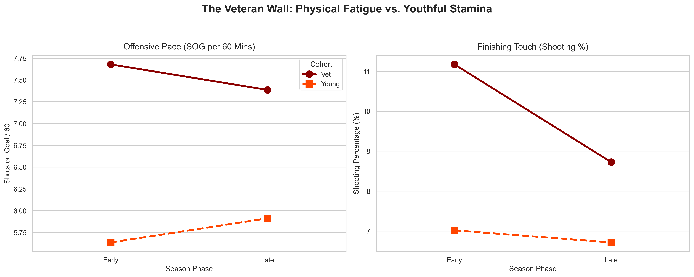
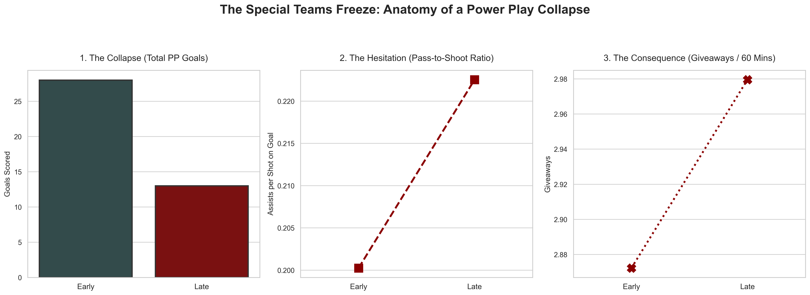
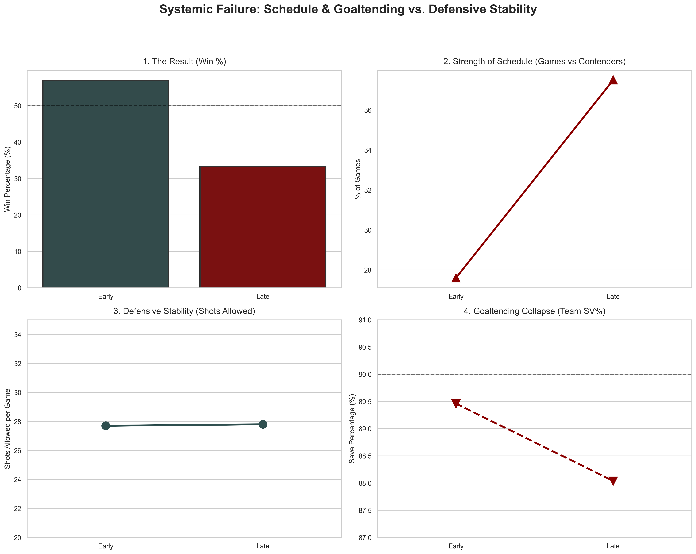

# 🏒 Anatomy of a Collapse: Detroit Red Wings 2025-2026 Season Analysis

## 📌 Executive Summary
For the first half of the 2025-2026 NHL season, the Detroit Red Wings were in a prime playoff position. Following the February Olympic break, the team suffered a catastrophic statistical tailspin, watching their win percentage plummet from **56.9% to 33.3%**. 

This project is a comprehensive, data-driven investigation into *why* the collapse happened. By extracting and analyzing telemetry for all 82 games via the NHL's live API—and benchmarking behavioral shifts against historical cross-market data—this analysis debunks popular fan narratives and proves the collapse was a perfect storm of **physical fatigue, psychological pressure, strength of schedule, and goaltending regression.**

---

## 📊 Key Findings

### 1. The "Veteran Wall" (Physical Fatigue)
Fan narratives blamed the veteran core for "disappearing," but the data reveals a severe case of physical exhaustion. 
* **The Data:** While the under-25 core (Raymond, Seider) actually increased their offensive volume (5.64 to 5.91 SOG/60), the veteran core (Larkin, DeBrincat) saw their finishing efficiency plummet. Their shooting percentage dropped from **11.17% in the Early phase down to 8.73% in the Late phase**.
* **The Insight:** The veterans still had the drive to push the pace, but the physical toll of an 82-game season destroyed their baseline accuracy.

*(Placeholder: Insert Dual-Axis Slopegraph here)*

### 2. The Special Teams "Freeze" & The Montreal Benchmark (Psychological Pressure)
Power Play goals cratered from 28 to just 13 down the stretch. To measure the psychological pressure driving this, I built a custom **Pass-to-Shoot Ratio** proxy metric and benchmarked the behavior against the ultimate pressure-cooker market: the Montreal Canadiens.
* **The Data:** Detroit's Pass-to-Shoot ratio for the core PP unit spiked from **0.200 to 0.222**, and unforced giveaways per 60 minutes increased from **2.87 to 2.98**.
* **The Benchmark Insight:** When comparing Detroit's late-season behavior to Montreal's historical data during peak media scrutiny, an identical pattern emerges. Like Montreal, Detroit exhibited a "turtle shell" psychological response to playoff pressure—abandoning aggressive, shoot-first instincts in favor of safe, hesitant perimeter passing and shot-blocking mentalities.

*(Placeholder: Insert Triptych Dashboard here)*

### 3. The Systemic Collapse (Schedule & Goaltending)
Offensive and psychological struggles only tell half the story. A holistic view of the team's system reveals the true fatal blow.
* **Defensive Stability (Debunked Narrative):** The defense did *not* quit. Pre-break, Detroit allowed 27.7 shots per game. Post-break, they allowed 27.8. Shot suppression remained completely flat.
* **Strength of Schedule:** The schedule became a gauntlet. The percentage of games against elite Contenders (100+ point pace) spiked from **27.6% to 37.5%**.
* **Goaltending Regression:** Forced to play a harder schedule with a fatigued offense, the goaltending collapsed. Team Save Percentage dropped from a survivable 89.46% to an unplayable **88.04%**.

*(Placeholder: Insert 2x2 Quad-Dashboard here)*

---

## 🛠️ Data Engineering & Methodology

Extracting clean telemetry from undocumented, evolving live sports APIs requires significant on-the-fly data engineering. This project utilizes the `nhl-api-py` wrapper hitting the NHL's v2 API (`api-web.nhle.com`), overcoming several major hurdles:

1. **Cross-Market Behavioral Benchmarking:** Established a psychological baseline for core unit performance by integrating historical telemetry (blocked shot rates, high-danger generation) from the Montreal Canadiens to measure "turtle shell" responses under high-leverage playoff pressure.
2. **Navigating "Phantom Keys" & Deprecations:** The 2026 API update quietly deprecated the `lastName` key in the boxscore endpoint. I engineered a custom parsing layer to extract the localized full-name string (`{"name": {"default": "Dylan Larkin"}}`) and split it dynamically for cohort mapping.
3. **Building Proxy Metrics:** When the API ceased serving `powerPlayToi` for individual skaters, I pivoted from measuring *Shots per PP Minute* to building the **Pass-to-Shoot Ratio** using raw Assists/SOG keys. This proxy metric ultimately provided a stronger behavioral insight into player hesitation.
4. **Handling Broken Goalie Strings (Anti-Crash Logic):** When goalies are pulled mid-game, the API collapses standard integers into fraction strings (e.g., `"8/13"`). I built an anti-crash string-splitter to detect fractions, slice the string, and cast the integers to maintain the integrity of the 90-game extraction loop.
5. **Dynamic Quality of Competition (QoC):** To accurately measure the Strength of Schedule without observer bias, I avoided hardcoded lists. The script queries the league standings endpoint for the *day prior to puck drop*. If the opponent had a Points Percentage >= .600 on that specific date (minimum 10 GP), the game was dynamically flagged as a Contender matchup.

---

## 💻 Tech Stack
* **Language:** Python 3.10+
* **Data Manipulation:** `pandas`, `numpy`, `datetime`
* **Data Visualization:** `matplotlib`, `seaborn`
* **Data Sourcing:** `nhlpy` (NHL v2 REST API)
